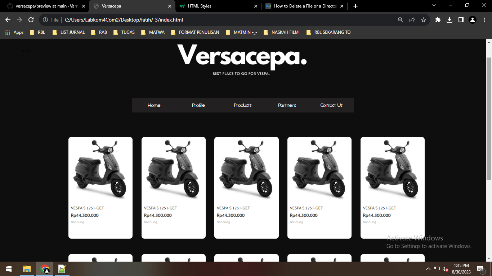
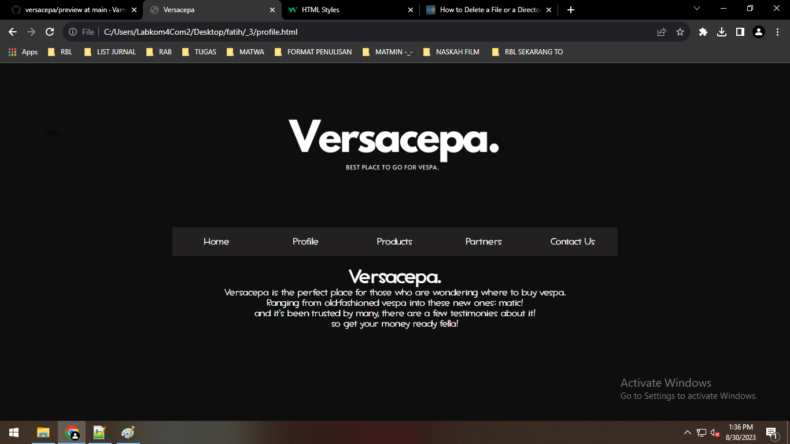
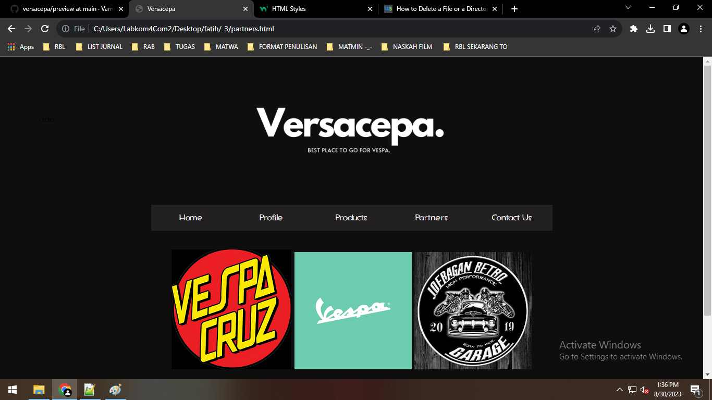
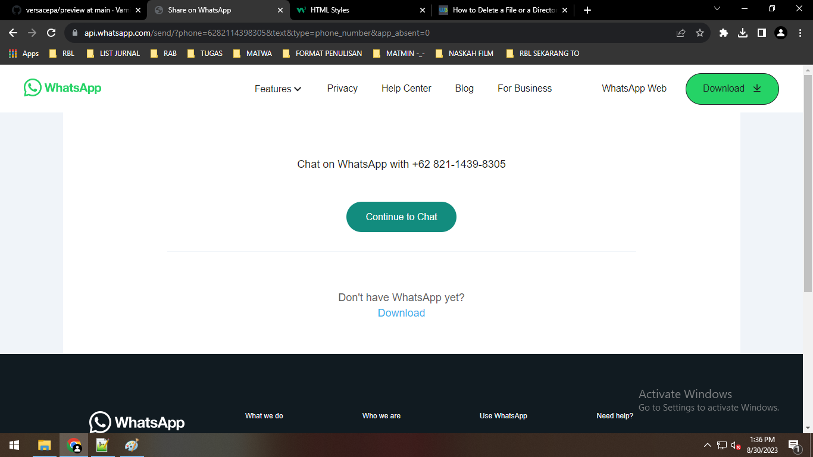

# Versacepa.
Belajar membuat website, dan saya kali ini saya memilih untuk membuat website penjualan vespa (abal-abal) :D

## Website preview

### Home

### Profile

### Partners

### Contact

Untuk produk "Matic" dan "Jadul" nya semua masih sama, karena semuanya masih berupa placeholder.